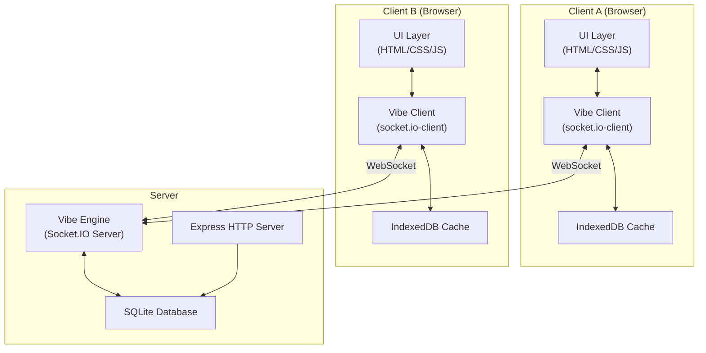
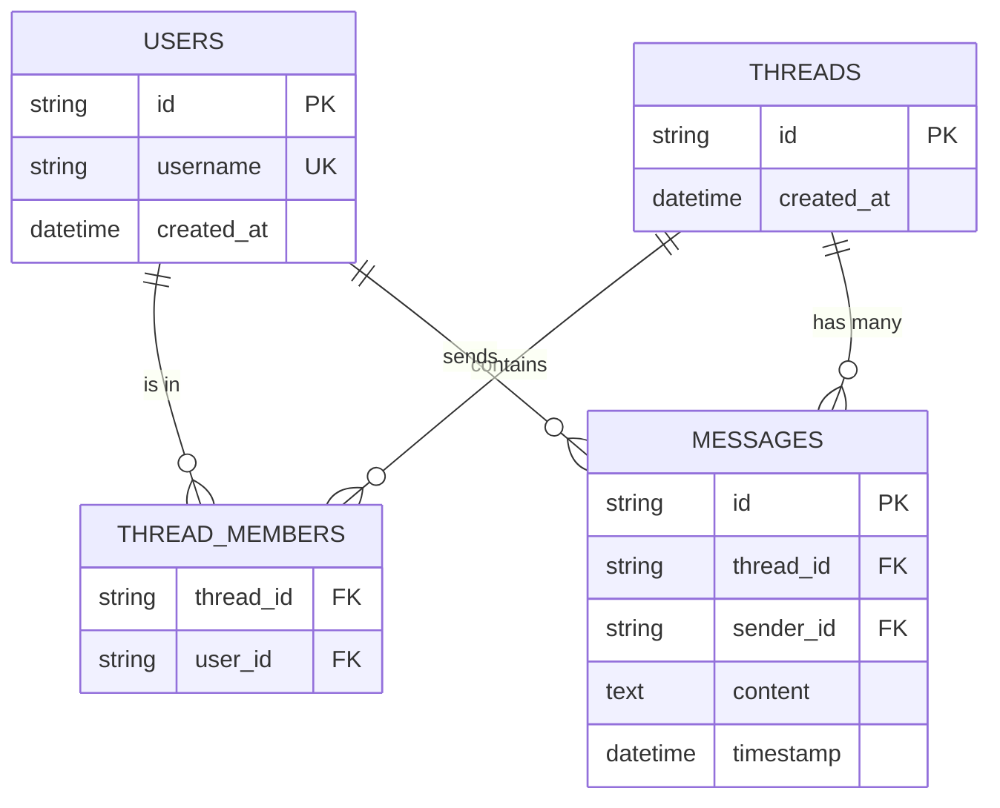

# VibeChat Architecture

## High-Level Architecture

The system uses a **Client-Server-Vibe** architecture where the **"Vibe"** is the real-time communication layer (implemented with WebSockets via Socket.IO) that keeps all connected clients in sync.

## Vibe Event Protocol

The Vibe Engine uses real-time WebSockets to synchronize states. The following events represent the protocol definition between Client and Server.

### From Client to Server
- **`vibe:join`**
  - **Payload:** `{ userId: string }`
  - **Action:** Authenticates socket connection, joins relevant thread rooms for `userId`.
- **`vibe:message`**
  - **Payload:** `{ threadId: string, content: string }`
  - **Action:** Server receives the message, saves it to SQLite, and broadcasts it to the room.
- **`vibe:typing`**
  - **Payload:** `{ threadId: string, userId: string }`
  - **Action:** Emitted while the client is typing. Server relays to other users in `threadId`.
- **`vibe:create-thread`**
  - **Payload:** `{ recipientId: string }`
  - **Action:** Mentions another user to start a conversation. Server creates a thread and notifies both users.

### From Server to Client
- **`vibe:joined`**
  - **Payload:** `Thread[]`
  - **Action:** Sends a list of threads representing the user's active conversations.
- **`vibe:message`**
  - **Payload:** `{ id, threadId, senderId, content, timestamp }`
  - **Action:** A new message was sent in `threadId`. Client updates state and UI.
- **`vibe:typing`**
  - **Payload:** `{ threadId, userId }`
  - **Action:** Notifies the client that someone is typing in `threadId`.
- **`vibe:thread-created`**
  - **Payload:** `Thread`
  - **Action:** A new thread was created involving the current user. Client updates their thread list.

## Database Schema (SQLite)

Data persistence is managed server-side by SQLite using `better-sqlite3`.

## State Management Flow

1. **Initialization:** Client opens the app and checks for previous threads/messages from IndexedDB (client-side cache).
2. **WebSocket Handshake:** Client connects to the Server and emits `vibe:join`. The server authenticates.
3. **Data Reconciliation:** Server responds with `vibe:joined` returning fresh threads. Client synchronizes the state and stores it back to IndexedDB. Rest APIs populate the rest of the message histories securely.
4. **Interactive State:** Client acts optimistically. Operations like `sendMessage` update in-memory state and cache instantly. When the server reflects changes backward, differences are reconciled to ensure consistency.
