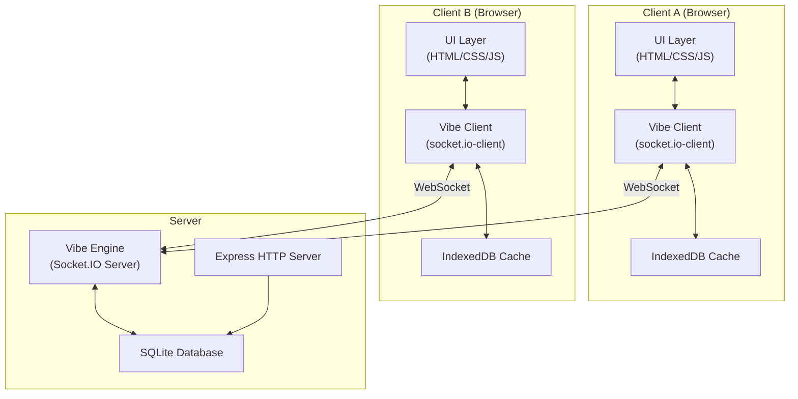

# Multi-User Real-Time Chat App — Implementation Plan

## 1. Goal

Build a **real-time, multi-user chat application** that supports concurrent sessions, persistent messaging, and multiple chat threads. The system uses a **Client-Server-Vibe** architecture where the **"Vibe"** is the real-time communication layer (implemented with WebSockets via Socket.IO) that keeps all connected clients in sync.

---

## 2. Technology Choices

| Layer | Technology | Rationale |
|---|---|---|
| **Runtime** | Node.js 20+ | Non-blocking I/O, ideal for real-time apps |
| **Server Framework** | Express.js | Lightweight HTTP layer for serving static files & REST endpoints |
| **Real-Time Engine ("Vibe")** | Socket.IO | Battle-tested WebSocket abstraction with rooms, namespaces, reconnection |
| **Persistence (Server)** | SQLite via `better-sqlite3` | Zero-config embedded DB; survives restarts; easy to upgrade to Postgres later |
| **Persistence (Client)** | IndexedDB (via `idb-keyval`) | Offline-first cache of last-N messages per thread |
| **Frontend** | Vanilla HTML + CSS + JS (ES Modules) | Matches PRD & Antigravity guidelines; no framework overhead |
| **Package Manager** | npm | Standard for Node.js |

---

## 3. High-Level Architecture



### The "Vibe" Flow

1. **Client** calls `connectToVibe()` → establishes a WebSocket connection and authenticates with a `user_id`.
2. **Server** registers the socket in a user-map and joins the socket to all thread rooms the user belongs to.
3. **Client** calls `sendMessage(text, threadId)` → emits a `vibe:message` event with a JSON payload.
4. **Server** receives the event, persists the message in SQLite, then broadcasts it to the thread room.
5. **All clients** in the room receive the payload via `onMessageReceived(payload)` → UI updates in real-time.

---

## 4. Project Structure (Final State)

```
chat-app/
├── package.json
├── server/
│   ├── index.js              # Express + Socket.IO bootstrap
│   ├── db.js                 # SQLite setup, schema, query helpers
│   ├── vibe.js               # Vibe engine: Socket.IO event handlers
│   └── routes/
│       └── api.js            # REST endpoints (fetch history, list threads)
├── public/
│   ├── index.html            # Single-page app shell
│   ├── css/
│   │   └── styles.css        # Full design system + responsive layout
│   ├── js/
│   │   ├── app.js            # Main entry: initializes modules, renders UI
│   │   ├── vibe-client.js    # connectToVibe(), sendMessage(), onMessageReceived()
│   │   ├── ui.js             # DOM manipulation: sidebar, chat window, input bar
│   │   ├── state.js          # Client-side state manager (threads, drafts, active thread)
│   │   └── storage.js        # IndexedDB persistence helpers
│   └── assets/
│       └── (generated images / icons)
└── docs/
    └── architecture.md       # Vibe flow diagram (delivered as part of checklist)
```

---

## 5. Phased Implementation

Each phase below is **self-contained**. An AI agent can execute any phase given the output of the previous one. Each phase lists:

- **Objective** — What this phase accomplishes.
- **Files to Create / Modify** — Exact file paths.
- **Detailed Steps** — Numbered implementation instructions.
- **Acceptance Criteria** — How to verify the phase is complete.

---

### Phase 1 — Project Scaffolding & Environment Setup

**Objective:** Initialize the Node.js project, install all dependencies, create the folder structure, and set up a dev server that serves a placeholder `index.html`.

#### Files to Create

| File | Purpose |
|---|---|
| `package.json` | Project manifest with scripts |
| `server/index.js` | Express server bootstrap (no Socket.IO yet) |
| `public/index.html` | Placeholder HTML shell |
| `public/css/styles.css` | Empty stylesheet with CSS reset |
| `public/js/app.js` | Console log "App loaded" |
| `.gitignore` | Ignore `node_modules/`, `*.db` |

#### Detailed Steps

1. **Initialize npm project** in `c:\Users\DELL\Desktop\ass2 ds\chat-app\`:
   ```bash
   npm init -y
   ```
2. **Install production dependencies:**
   ```bash
   npm install express socket.io better-sqlite3
   ```
3. **Install dev dependencies:**
   ```bash
   npm install --save-dev nodemon
   ```
4. **Configure `package.json` scripts:**
   ```json
   {
     "scripts": {
       "start": "node server/index.js",
       "dev": "nodemon server/index.js"
     }
   }
   ```
5. **Create `server/index.js`:**
   - Import `express`, create an app.
   - Serve static files from `../public`.
   - Listen on `process.env.PORT || 3000`.
   - Log `"Server running on http://localhost:3000"`.
6. **Create `public/index.html`:**
   - Minimal HTML5 boilerplate with `<title>VibeChat</title>`.
   - Link to `css/styles.css`.
   - Include `<script type="module" src="js/app.js"></script>`.
   - Add a `<div id="app">Loading...</div>`.
7. **Create `public/css/styles.css`:**
   - CSS reset (`*, *::before, *::after { box-sizing: border-box; margin: 0; padding: 0; }`).
   - Import Google Font **Inter** via `@import`.
   - Set `body { font-family: 'Inter', sans-serif; }`.
8. **Create `public/js/app.js`:**
   - `console.log('VibeChat app loaded');`.
9. **Create `.gitignore`:**
   - `node_modules/`, `*.db`, `.env`.

#### Acceptance Criteria

- [ ] Running `npm run dev` starts the server on port 3000 without errors.
- [ ] Visiting `http://localhost:3000` shows the placeholder page.
- [ ] Browser console logs "VibeChat app loaded".

---

### Phase 2 — Database Schema & Server-Side Persistence

**Objective:** Design and implement the SQLite database schema. Create query helper functions for all CRUD operations the app will need.

#### Files to Create / Modify

| File | Action | Purpose |
|---|---|---|
| `server/db.js` | CREATE | SQLite connection, schema init, query helpers |
| `server/routes/api.js` | CREATE | REST API endpoints |
| `server/index.js` | MODIFY | Mount API routes |

#### Detailed Steps

1. **Create `server/db.js`:**

   - Open (or create) `chat.db` in the project root using `better-sqlite3`.

   - **Schema — `users` table:**
     ```sql
     CREATE TABLE IF NOT EXISTS users (
       id         TEXT PRIMARY KEY,
       username   TEXT NOT NULL UNIQUE,
       created_at TEXT DEFAULT (datetime('now'))
     );
     ```

   - **Schema — `threads` table:**
     ```sql
     CREATE TABLE IF NOT EXISTS threads (
       id         TEXT PRIMARY KEY,
       created_at TEXT DEFAULT (datetime('now'))
     );
     ```

   - **Schema — `thread_members` table:**
     ```sql
     CREATE TABLE IF NOT EXISTS thread_members (
       thread_id TEXT NOT NULL REFERENCES threads(id),
       user_id   TEXT NOT NULL REFERENCES users(id),
       PRIMARY KEY (thread_id, user_id)
     );
     ```

   - **Schema — `messages` table:**
     ```sql
     CREATE TABLE IF NOT EXISTS messages (
       id         TEXT PRIMARY KEY,
       thread_id  TEXT NOT NULL REFERENCES threads(id),
       sender_id  TEXT NOT NULL REFERENCES users(id),
       content    TEXT NOT NULL,
       timestamp  TEXT DEFAULT (datetime('now'))
     );
     CREATE INDEX IF NOT EXISTS idx_messages_thread ON messages(thread_id, timestamp);
     ```

   - **Export helper functions:**
     - `createUser(id, username)` → INSERT OR IGNORE
     - `getUser(id)` → SELECT by id
     - `createThread(id, memberIds[])` → INSERT thread + thread_members rows (transaction)
     - `getThreadsForUser(userId)` → SELECT threads where user is a member, with last message preview
     - `saveMessage({ id, threadId, senderId, content, timestamp })` → INSERT
     - `getMessages(threadId, limit = 50)` → SELECT last N messages ordered by timestamp ASC

2. **Create `server/routes/api.js`:**

   - `GET /api/threads/:userId` → calls `getThreadsForUser(userId)`, returns JSON array.
   - `GET /api/messages/:threadId` → calls `getMessages(threadId)`, returns JSON array.
   - `POST /api/threads` → body `{ memberIds: [id1, id2] }`, calls `createThread()`, returns the new thread.
   - `POST /api/users` → body `{ id, username }`, calls `createUser()`, returns the user.

3. **Modify `server/index.js`:**
   - Import and mount `/api` routes.
   - Add `express.json()` middleware.

#### Acceptance Criteria

- [ ] Starting the server creates `chat.db` with all 4 tables.
- [ ] `POST /api/users` creates a user and returns `201`.
- [ ] `POST /api/threads` creates a thread with members.
- [ ] `GET /api/messages/:threadId` returns an empty array for a new thread.

---

### Phase 3 — Vibe Engine (Real-Time Connection Logic)

**Objective:** Implement the server-side Socket.IO "Vibe Engine" with `connectToVibe()`, message broadcasting, and thread room management. Implement the client-side Vibe module with `connectToVibe()`, `sendMessage()`, and `onMessageReceived()`.

#### Files to Create / Modify

| File | Action | Purpose |
|---|---|---|
| `server/vibe.js` | CREATE | Server-side Socket.IO event handlers |
| `server/index.js` | MODIFY | Attach Socket.IO to HTTP server |
| `public/js/vibe-client.js` | CREATE | Client-side Vibe module with the 3 required functions |

#### Detailed Steps

1. **Modify `server/index.js`:**
   - Create HTTP server with `http.createServer(app)`.
   - Import `Server` from `socket.io` and attach to the HTTP server.
   - Import and call `initVibe(io)` from `server/vibe.js`.
   - Change `app.listen()` to `httpServer.listen()`.

2. **Create `server/vibe.js` — `initVibe(io)` function:**

   ```
   // The Vibe Engine — manages real-time communication channels
   ```

   - **On connection (`io.on('connection', socket => { ... })`):**

     a. **`vibe:join` event** — Client sends `{ userId }`:
        - Store `userId` on the socket object.
        - Look up all threads for this user (via `db.getThreadsForUser`).
        - Join the socket to each thread room: `socket.join(thread.id)`.
        - Emit `vibe:joined` back to the client with the thread list.
        - Store the socket-to-user mapping in a `Map<userId, socketId>`.

     b. **`vibe:message` event** — Client sends `{ threadId, content }`:
        - Generate a UUID for the message (`crypto.randomUUID()`).
        - Build the message object: `{ id, threadId, senderId: socket.userId, content, timestamp: new Date().toISOString() }`.
        - Persist via `db.saveMessage(msg)`.
        - Broadcast to the thread room: `io.to(threadId).emit('vibe:message', msg)`.

     c. **`vibe:create-thread` event** — Client sends `{ recipientId }`:
        - Create a new thread with `db.createThread(uuid, [socket.userId, recipientId])`.
        - Join both users' sockets to the new room (look up recipient's socket from the map).
        - Emit `vibe:thread-created` to both users with the thread data.

     d. **`disconnect` event:**
        - Remove the user from the socket-to-user map.
        - Broadcast `vibe:user-offline` to relevant rooms.

3. **Create `public/js/vibe-client.js`:**

   - Import `socket.io-client` from CDN or served file.

   - **`connectToVibe(userId)` function:**
     ```js
     /**
      * connectToVibe() — Initializes the Antigravity Vibe provider.
      * Sets up the WebSocket connection, authenticates the user,
      * and registers all listeners for the real-time communication channel.
      * @param {string} userId - The current user's unique identifier
      * @returns {Promise<Socket>} - The connected socket instance
      */
     ```
     - Create socket: `io({ query: { userId } })`.
     - Emit `vibe:join` with `{ userId }`.
     - Listen for `vibe:joined` → resolve with thread list.
     - Listen for `vibe:message` → call `onMessageReceived(payload)`.
     - Listen for `vibe:thread-created` → update state.
     - Listen for `connect_error`, `disconnect` → update connection status.
     - Return the socket.

   - **`sendMessage(text, threadId)` function:**
     ```js
     /**
      * sendMessage() — Packages the text into a JSON payload and
      * emits it through the Vibe channel to the specified thread.
      * @param {string} text - The message content
      * @param {string} threadId - The target thread ID
      */
     ```
     - Emit `vibe:message` with `{ threadId, content: text }`.

   - **`onMessageReceived(payload)` callback:**
     ```js
     /**
      * onMessageReceived() — Background listener callback triggered
      * when the Vibe pushes a new message packet. Updates the client
      * state and triggers a UI re-render of the chat window.
      * @param {Object} payload - { id, threadId, senderId, content, timestamp }
      */
     ```
     - Will be wired to state + UI in Phase 4.
     - For now, log the payload and dispatch a custom event.

   - Export all three functions.

#### Acceptance Criteria

- [ ] Two browser tabs can connect to the server; server logs both connections.
- [ ] Emitting `vibe:join` from the client receives a `vibe:joined` response.
- [ ] Sending a message from one tab appears in the server log and is broadcast to the other tab.
- [ ] Messages are persisted in SQLite (verifiable via `GET /api/messages/:threadId`).

---

### Phase 4 — Client-Side State Management & UI Shell

**Objective:** Build the full UI (sidebar, chat window, input bar, connection indicator) and wire it to the client-side state manager. No persistence yet — state is in-memory only.

#### Files to Create / Modify

| File | Action | Purpose |
|---|---|---|
| `public/css/styles.css` | MODIFY | Full design system, layout, animations |
| `public/js/state.js` | CREATE | Centralized reactive state manager |
| `public/js/ui.js` | CREATE | DOM rendering: sidebar, chat, input, status indicator |
| `public/js/app.js` | MODIFY | Wire state, UI, and Vibe client together |
| `public/index.html` | MODIFY | Add semantic HTML structure |

#### Detailed Steps

1. **Create `public/js/state.js`:**
   - Maintain a state object:
     ```js
     {
       currentUserId: null,
       threads: [],              // [{ id, members, lastMessage }]
       activeThreadId: null,
       messages: {},             // { [threadId]: Message[] }
       drafts: {},               // { [threadId]: string } — preserves drafts when switching threads
       connectionStatus: 'disconnected' // 'connected' | 'disconnected' | 'reconnecting'
     }
     ```
   - Implement a simple pub/sub: `subscribe(event, callback)`, `emit(event, data)`.
   - State mutation functions: `setActiveThread(id)`, `addMessage(msg)`, `setThreads(list)`, `updateDraft(threadId, text)`, `setConnectionStatus(status)`.
   - Each mutation emits the relevant event (e.g., `'messages-updated'`, `'thread-changed'`).

2. **Modify `public/index.html`:**
   ```html
   <div id="app">
     <!-- Login overlay -->
     <div id="login-overlay">...</div>
     
     <!-- Main chat layout -->
     <div id="chat-layout" class="hidden">
       <aside id="sidebar">
         <div id="sidebar-header">
           <h2>Chats</h2>
           <button id="new-chat-btn" title="New Chat">+</button>
         </div>
         <ul id="thread-list"></ul>
       </aside>
       <main id="chat-area">
         <header id="chat-header">
           <span id="chat-title">Select a chat</span>
           <span id="connection-status" class="status-dot"></span>
         </header>
         <div id="messages-container"></div>
         <form id="message-form">
           <input id="message-input" type="text" placeholder="Type a message..." autocomplete="off" />
           <button id="send-btn" type="submit">Send</button>
         </form>
       </main>
     </div>
   </div>
   ```

3. **Modify `public/css/styles.css` — Full Design System:**

   - **Color palette (CSS custom properties):**
     - Dark theme: `--bg-primary: hsl(225, 20%, 8%)`, `--bg-secondary: hsl(225, 18%, 12%)`, `--bg-tertiary: hsl(225, 16%, 18%)`.
     - Accent: `--accent: hsl(250, 90%, 65%)`, `--accent-hover: hsl(250, 90%, 72%)`.
     - Text: `--text-primary: hsl(0, 0%, 95%)`, `--text-secondary: hsl(0, 0%, 65%)`.
     - Status: `--status-online: hsl(145, 80%, 50%)`, `--status-offline: hsl(0, 80%, 55%)`.
     - Sent bubble: `--bubble-sent: hsl(250, 60%, 38%)`, received: `--bubble-received: hsl(225, 16%, 22%)`.

   - **Layout:**
     - `#chat-layout`: CSS Grid — `grid-template-columns: 320px 1fr;`, full viewport height.
     - Sidebar: scrollable thread list, glassmorphism header (`backdrop-filter: blur(12px)`).
     - Chat area: flex column, messages container `flex: 1; overflow-y: auto;`.

   - **Components:**
     - **Thread item**: hover effect with `transform: translateX(4px)`, active state with accent border-left.
     - **Message bubbles**: `max-width: 70%`, border-radius: `18px`, subtle box-shadow, sent aligned right, received aligned left.
     - **Input bar**: rounded input with glassmorphism background, send button with gradient and hover scale.
     - **Connection status dot**: 10px circle, pulse animation when connected.
     - **Login overlay**: centered card with glassmorphism, subtle gradient border.
     - **Scrollbar**: custom thin scrollbar styling.

   - **Animations:**
     - `@keyframes fadeInUp` for new messages.
     - `@keyframes pulse` for status dot.
     - `@keyframes slideIn` for sidebar items.
     - All transitions: `transition: all 0.2s ease`.

   - **Responsive:** `@media (max-width: 768px)` — sidebar becomes a toggleable overlay.

4. **Create `public/js/ui.js`:**

   - **`renderSidebar(threads, activeThreadId)`** — Populate `#thread-list`. Highlight active thread. Show last message preview and timestamp.
   - **`renderMessages(messages, currentUserId)`** — Populate `#messages-container` with bubble-style messages. Auto-scroll to bottom. Show timestamps.
   - **`renderConnectionStatus(status)`** — Toggle `#connection-status` class (green dot / red dot / pulsing).
   - **`showLoginOverlay()` / `hideLoginOverlay()`** — Toggle the login screen.
   - **`showNewChatDialog()`** — Prompt for recipient ID (could be a modal or inline input).
   - **Event bindings:**
     - `#message-form` submit → get text, call `sendMessage()`, clear input.
     - `#thread-list` click delegation → `setActiveThread(clickedThreadId)`.
     - `#new-chat-btn` click → `showNewChatDialog()`.
     - `#message-input` input → `updateDraft(activeThreadId, value)`.

5. **Modify `public/js/app.js`:**

   - On load:
     a. Show login overlay, collect `userId` and `username`.
     b. Call `POST /api/users` to register/ensure user exists.
     c. Call `connectToVibe(userId)`.
     d. On `vibe:joined` → `setThreads(threads)`, hide login, render sidebar.
     e. Subscribe to state events → call the corresponding UI render functions.
   - Wire `onMessageReceived` to `state.addMessage()`.
   - Wire send form to `vibeClient.sendMessage()`.
   - Wire new-chat to emit `vibe:create-thread`.

#### Acceptance Criteria

- [ ] Login overlay appears on load; entering a username connects to the Vibe.
- [ ] Connection status indicator turns green when connected.
- [ ] Sidebar lists threads (empty initially); "New Chat" button opens a dialog.
- [ ] Creating a new chat with a recipient ID creates a thread visible in both users' sidebars.
- [ ] Sending a message from User A appears in real-time on User B's chat window.
- [ ] Switching threads preserves the message draft in the input field.
- [ ] Messages render as styled bubbles (right = sent, left = received).
- [ ] UI is responsive; sidebar collapses on narrow viewports.

---

### Phase 5 — Client-Side Persistence (IndexedDB)

**Objective:** Add IndexedDB as a client-side cache so messages load instantly on reconnection before the server round-trip completes. Implement optimistic UI updates.

#### Files to Create / Modify

| File | Action | Purpose |
|---|---|---|
| `public/js/storage.js` | CREATE | IndexedDB wrapper for message & thread caching |
| `public/js/app.js` | MODIFY | Integrate storage into the init & message flow |
| `public/js/vibe-client.js` | MODIFY | Cache messages on receive, load from cache on join |

#### Detailed Steps

1. **Create `public/js/storage.js`:**

   - Open an IndexedDB database `vibe-chat-db`, version 1.
   - **Object Stores:**
     - `messages` — keyPath: `id`, indexes: `threadId`, `timestamp`.
     - `threads` — keyPath: `id`.
     - `drafts` — keyPath: `threadId`.
   - **Exported functions:**
     - `saveMessageToCache(message)` → put into `messages` store.
     - `getMessagesFromCache(threadId, limit = 50)` → get by index, sorted by timestamp desc, return last N.
     - `saveThreadsToCache(threads)` → put all into `threads` store.
     - `getThreadsFromCache()` → getAll from `threads` store.
     - `saveDraft(threadId, text)` → put into `drafts` store.
     - `getDraft(threadId)` → get from `drafts` store.
     - `clearDraft(threadId)` → delete from `drafts` store.

2. **Modify `public/js/app.js`:**

   - On load (before Vibe connect):
     - Load cached threads → render sidebar immediately (stale-while-revalidate pattern).
     - Load cached messages for last active thread → render chat immediately.
   - After `vibe:joined`:
     - Merge server threads with cached threads, update cache.
   - After fetching message history from API:
     - Update IndexedDB cache.

3. **Modify `public/js/vibe-client.js`:**

   - In `onMessageReceived`:
     - Call `saveMessageToCache(payload)` alongside `state.addMessage(payload)`.
   - In `sendMessage`:
     - Optimistically add the message to state & cache before server confirms.
     - If the server rejects (error handler), remove from state & cache, show error toast.

#### Acceptance Criteria

- [ ] Closing and reopening the browser shows the last 50 messages from IndexedDB instantly.
- [ ] After the server responds with fresh data, the UI updates seamlessly (no flicker).
- [ ] Drafts persist across page reloads.
- [ ] Clearing browser data and reloading fetches fresh data from the server.

---

### Phase 6 — Polish, Animations & Error Handling

**Objective:** Add micro-animations, error handling, toast notifications, typing indicators, and final visual polish to create a premium feel.

#### Files to Create / Modify

| File | Action | Purpose |
|---|---|---|
| `public/css/styles.css` | MODIFY | Add animation keyframes, toast styles, typing indicator |
| `public/js/ui.js` | MODIFY | Toast system, typing indicator, scroll behavior enhancements |
| `server/vibe.js` | MODIFY | Add `vibe:typing` event relay |
| `public/js/vibe-client.js` | MODIFY | Emit/receive typing events |

#### Detailed Steps

1. **Toast Notification System:**
   - Add a `#toast-container` (fixed, top-right) to `index.html`.
   - `ui.showToast(message, type)` — type: `'success'`, `'error'`, `'info'`.
   - Auto-dismiss after 4 seconds with fade-out animation.
   - Use for: connection errors, message send failures, user joined notifications.

2. **Typing Indicators:**
   - Client emits `vibe:typing` with `{ threadId, userId }` on input keypress (debounced 500ms).
   - Server relays to the thread room (excluding sender).
   - Receiving client shows "User is typing..." with animated dots below the messages.

3. **Enhanced Animations:**
   - New messages slide in from the bottom with `fadeInUp` (0.3s ease-out).
   - Sidebar thread items animate in with staggered `slideIn`.
   - Send button: press animation (`transform: scale(0.95)`).
   - Smooth scroll to bottom on new message with `scrollIntoView({ behavior: 'smooth' })`.

4. **Error Handling:**
   - Wrap all socket emissions in try-catch.
   - Implement reconnection UI: show a banner "Reconnecting..." with a spinner.
   - Handle `disconnect` → update status to red, show toast.
   - Handle `connect` after disconnect → re-emit `vibe:join`, refresh threads, show toast "Reconnected".

5. **Empty States:**
   - No threads: illustration + "Start a new conversation" prompt.
   - No messages in thread: "Say hello! 👋" centered text.
   - No active thread selected: centered illustration + "Select a chat to start messaging".

6. **Accessibility:**
   - All interactive elements have `aria-label`.
   - Focus management: auto-focus input on thread switch.
   - Keyboard navigation: `Escape` to close modals, `Enter` to send.

#### Acceptance Criteria

- [ ] Toast notifications appear for connection/disconnection events.
- [ ] Typing indicator shows when the other user is typing.
- [ ] New messages animate into view smoothly.
- [ ] Disconnecting the network shows a red status dot and reconnection banner.
- [ ] Empty states display appropriate illustrations/messages.

---

### Phase 7 — Testing, Documentation & Delivery

**Objective:** Verify all functional requirements, create the architecture diagram document, and ensure the delivery checklist is complete.

#### Files to Create / Modify

| File | Action | Purpose |
|---|---|---|
| `docs/architecture.md` | CREATE | Vibe flow architecture diagram + system documentation |
| `public/index.html` | MODIFY | Add SEO meta tags, final title |
| `server/index.js` | MODIFY | Add CORS config, production-ready settings |

#### Detailed Steps

1. **Create `docs/architecture.md`:**
   - Include the Mermaid diagram from Section 3 above.
   - Document the Vibe event protocol (all events, payloads, direction).
   - Document the database schema with an ER diagram.
   - Document the state management flow.

2. **Functional Testing (Manual, via two browser windows):**
   - **FR1 — Multi-User Communication:**
     - Open two browser windows, log in as different users.
     - Create a thread between them.
     - Send messages back and forth; verify real-time delivery.
     - Verify each message has `sender_id`, `timestamp`, `content`, `thread_id`.
   - **FR2 — Persistent Chat History:**
     - Send several messages, refresh the page.
     - Verify the last 50 messages load on startup.
     - Restart the server, verify messages survive.
   - **FR3 — Multiple Chat Threads:**
     - Create multiple threads with different users.
     - Switch between threads, verify messages are correct per thread.
     - Type a draft in one thread, switch to another, switch back — verify draft preserved.

3. **Verify Delivery Checklist:**
   - [ ] Clean, modular code with comments on key Antigravity/Vibe logic (`connectToVibe()`, `sendMessage()`, `onMessageReceived()`).
   - [ ] Responsive UI that works for two simulated windows side-by-side.
   - [ ] Architecture diagram with the Vibe flow in `docs/architecture.md`.

4. **Final Production Hardening:**
   - Add `helmet` middleware for security headers.
   - Configure CORS to allow the correct origins.
   - Add graceful shutdown handling (`SIGTERM`, `SIGINT`).
   - Ensure `better-sqlite3` WAL mode for concurrent reads.

5. **SEO & Meta Tags:**
   - `<title>VibeChat — Real-Time Multi-User Chat</title>`
   - `<meta name="description" content="A real-time, multi-user chat application built with the Vibe engine.">`
   - Proper `<meta charset>`, `<meta viewport>`.

#### Acceptance Criteria

- [ ] All 3 functional requirements pass manual testing.
- [ ] `docs/architecture.md` contains a complete Vibe flow diagram.
- [ ] Code has clear comments on `connectToVibe()`, `sendMessage()`, and `onMessageReceived()`.
- [ ] Server starts cleanly in production mode (`npm start`).
- [ ] Two browser windows can chat in real-time with full persistence.

---

## 6. User Review Required

> [!IMPORTANT]
> ### Design Decisions Requiring Approval
> 1. **"Antigravity SDK" Interpretation:** The PRD references an "Antigravity SDK/framework." Since no such real SDK exists, I'm implementing the "Vibe" concept using **Socket.IO** (industry-standard WebSocket library) while preserving all the PRD's naming conventions (`connectToVibe()`, `sendMessage()`, `onMessageReceived()`) and documenting them as "Antigravity Vibe" functions. Is this acceptable?
> 2. **SQLite vs. Cloud DB:** Using SQLite for simplicity and zero config. This is fine for local development and small-scale deployment. Would you prefer a cloud DB (e.g., Firebase, Supabase) instead?
> 3. **Authentication:** The PRD doesn't specify authentication. I'm using a simple username-based identification (no passwords). Should I add proper auth (JWT, sessions)?
> 4. **Dark Theme Only:** The design uses a dark theme by default (modern, premium feel). Should I add a light theme toggle?

## 7. Open Questions

> [!NOTE]
> - Should the app support **group chats** (3+ users per thread), or strictly **1-on-1** conversations?
> - Is there a preference for the **port number** or should it remain configurable via environment variable?
> - Should the app support **file/image sharing**, or is text-only sufficient for this version?

## 8. Verification Plan

### Automated Verification
```bash
# Start the server
npm run dev

# Verify server responds
curl http://localhost:3000
curl http://localhost:3000/api/threads/test-user
```

### Browser Testing
- Open two side-by-side browser windows at `http://localhost:3000`.
- Log in as `user-alice` and `user-bob`.
- Perform the full test matrix from Phase 7.

### Code Quality
- Verify all 3 required functions (`connectToVibe()`, `sendMessage()`, `onMessageReceived()`) are implemented with JSDoc comments.
- Verify modular file structure matches the project structure diagram.
